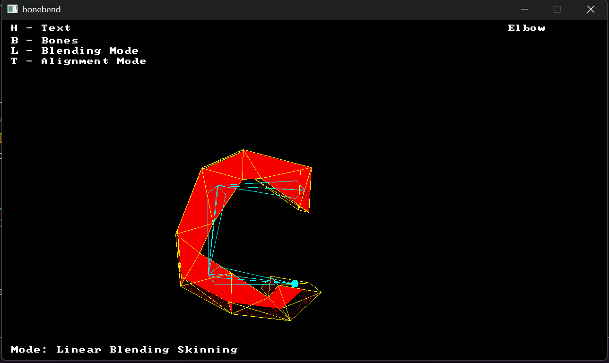
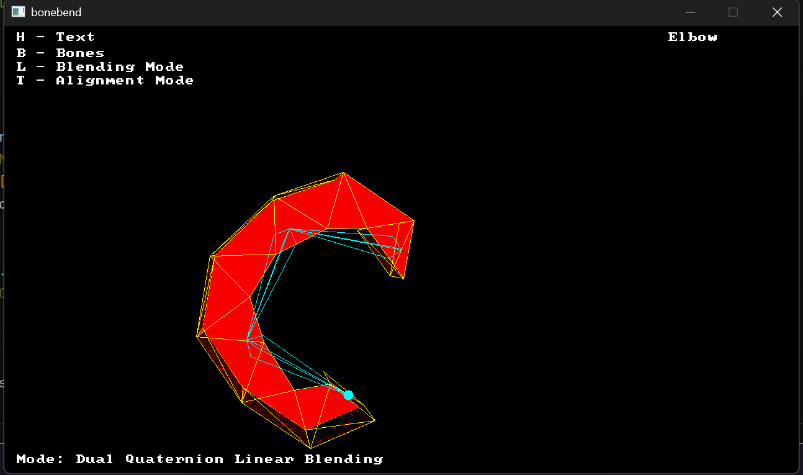
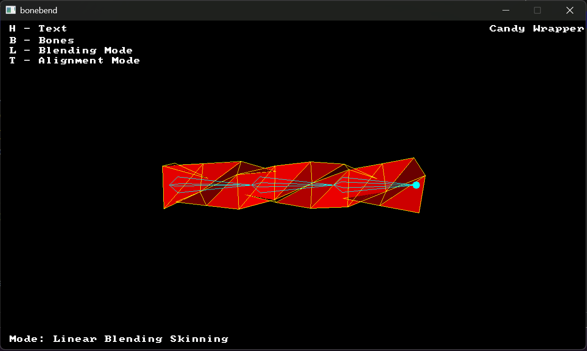
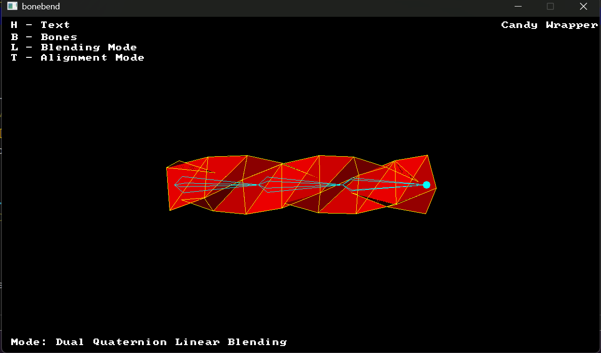

# Bonebend

A baby small project that uses skeletal animation (**Linear Blend Skinning (LBS)** and **Dual Quaternion Skinning (DQS)**) 
using SDL with simple bending and twist mesh.

Most stuff in here are made from scratch with a few credits here and there. 

This project is pretty much based on Pikumas 3D course where they go through some 3D software rendering

I have some written notes for the bendy skeleton math here: https://wodrik.com/graphics_programming/bone_bend.html
which can be of interest when reading this code.

Here is a few screenshots for quick comparison of linear and dual quaterion interpolation with an elbow
and the well known candy-wrapper problem:


comparing against dual quaternion:


here is the candy wrapper problem:

comparing against dual quaternion:



## Controls

| Key | Action |
|---|---|
| `T` | Toggle chain axis (bend / twist) |
| `L` | Toggle skinning mode (LBS / DQS) |
| `B` | Toggle bone visualization |
| `M` | Toggle mesh visualization |
| `H` | Toggle on-screen help/text |
| `←` / `→` (hold) | Orbit camera |
| `Esc` | Quit |


## Building

Requires CMake 3.20+. SDL3 is pulled automatically via `FetchContent` — no manual install needed.

```bash
cmake -B build
cmake --build build
```

## Acknowledgments

- Built while following [Pikuma's 3D Computer Graphics Programming](https://pikuma.com/) course as
  a base for the rasterizer.
- Dual quaternion skinning follows the approach described in Kavan et al., *"Skinning with Dual
  Quaternions"* (I3D 2007) and *"Geometric Skinning with Approximate Dual Quaternion Blending"*
  (TOG 2008).
- The matrix <-> quaternion conversion is adapted from [GLM](https://github.com/g-truc/glm)'s
  `quat_cast`/`mat3_cast` implementation (Shepperd's method), licensed under the MIT / Happy Bunny
  License, Copyright (c) 2005 G-Truc Creation.

love you, byee